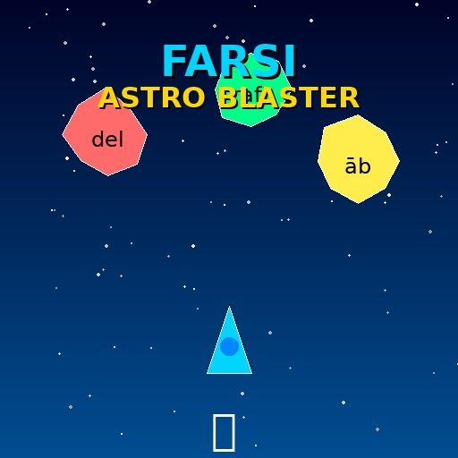

# 🚀 Farsi Astro Blaster



An engaging, arcade-style vocabulary game for learning romanized Farsi words through fast-paced gameplay. Defend Earth by translating falling asteroids labeled with Farsi words before they reach the bottom!

## 🎮 [Play Now!](https://psam2016.github.io/farsi-astro-blaster/)

**▶️ [Click here to play the game online](https://psam2016.github.io/farsi-astro-blaster/)** - No installation required!


## 🎮 Game Description

Farsi Astro Blaster is an educational arcade game that combines fast-paced action with language learning. Players control a spaceship and must type the English meanings of romanized Farsi words to destroy asteroids before they reach the bottom of the screen. The game features progressive difficulty, a combo system, and tracks your high score for continuous improvement.

## 🎯 Learning Objectives

- **Quick Recall**: Practice instant recognition and translation of Farsi vocabulary
- **Vocabulary Retention**: Repeated exposure to words in a fun, engaging context
- **Speed & Accuracy**: Build fluency through timed challenges
- **Comprehensive Coverage**: Learn verbs (with conjugations), nouns, adjectives, and common phrases

## 🕹️ How to Play

### Difficulty Selection 🆕
Choose your difficulty level before starting:
- **🌱 Easy**: Perfect for A1 beginners - Much slower asteroids, more time to think (12s spawn interval, only 1 asteroid)
- **⭐ Normal**: Balanced challenge for intermediate learners
- **🔥 Hard**: Fast-paced action for advanced players

### Practice Options 🆕
- **Sentence Mode**: Optional advanced practice where you complete English sentences with Farsi words (activates at Level 6 if enabled)
- **Learning Hints** 💡: Enable contextual hints and grammar tips (recommended for beginners)

### Controls
- **Type**: Enter the English meaning of the Farsi word shown on asteroids
- **Enter**: Submit your answer and destroy matching asteroids
- **Spacebar/P**: Pause and resume the game
- **H Key**: Toggle hint panel (when not typing in input field)
- **Click "Show Hint"**: Get progressive hints for the current word
- **Click "Start Game"**: Begin a new game

### Learning Hints System 💡 🆕
When hints are enabled, you get contextual learning support:
1. **Grammar Tips**: Educational tips appear at the top when asteroids spawn (e.g., "mi- prefix = present tense")
2. **Progressive Hints**: Click "Show Hint" button or press H key for help:
   - **Level 1**: Shows grammar note (e.g., "imperative form")
   - **Level 2**: Shows first letter of English word (e.g., "T___")
   - **Level 3**: Shows full English translation
3. **Educational Context**: Learn Farsi patterns and grammar rules while waiting for asteroids
4. Perfect for beginners who need extra support without pressure

### Gameplay

**Levels 1-5: Translation Mode**
1. Asteroids fall from the top of the screen, each labeled with a romanized Farsi word
2. Type the English meaning in the input field
3. Press Enter to check your answer
4. Correct answers destroy the asteroid and award points
5. Build combos (up to 5x multiplier) for consecutive correct answers
6. Don't let asteroids reach the bottom - you lose a life!
7. Level up every 5 asteroids destroyed - difficulty increases gradually

**Level 6+: Sentence Mode** 🆕
1. An English sentence with a blank appears at the top
2. Multiple asteroids fall with different Farsi words
3. Type the Farsi word that correctly completes the sentence
4. More challenging - requires understanding context and grammar!
5. New sentence appears after each correct answer

**Game Over**
- Game ends when you run out of all 3 lives
- View your missed words in the Word Bank for study

### Level System (Normal Difficulty)
The game features progressive difficulty across multiple levels - designed for A1 learners:

- **Level 1**: Complete beginner - 1 asteroid, extremely slow (8s spawn, 0.25 speed) 🆕
- **Level 2**: Still learning - 1 asteroid, very slow (7s spawn, 0.3 speed) 🆕
- **Level 3**: Building confidence - 1 asteroid, slow (6s spawn, 0.4 speed) 🆕
- **Level 4**: Ready for more - 2 asteroids, moderate (5s spawn, 0.5 speed)
- **Level 5**: Getting comfortable - 2 asteroids (4.5s spawn, 0.6 speed)
- **Level 6**: Sentence mode begins (if enabled) - 2 asteroids (4s spawn, 0.7 speed)
- **Level 7**: Intermediate - 3 asteroids (3.5s spawn, 0.8 speed)
- **Level 8+**: Progressive challenge - gradual difficulty increase (max 4 asteroids)

### Scoring System
- **Base Points**: 10 points per correct answer
- **Combo Multiplier**: 2x, 3x, 4x, 5x for consecutive correct answers
- **Example**: 5th correct answer in a row = 50 points!
- **Level Up**: Destroy 5 asteroids to advance to the next level

## 📚 Vocabulary List

The game includes 35 carefully selected Farsi words covering various categories:

| Romanized Farsi | English | Grammar Notes |
|-----------------|---------|---------------|
| shekondam | i broke | past tense, 1st person singular |
| mibaram | i carry | present continuous with mi- prefix |
| bardār | take | imperative form |
| raft | went | past tense, 3rd person |
| shekāyat | complaint | noun |
| del | heart | noun |
| dast | hand | noun |
| hāl | state | noun |
| dāghūn | burning | adjective |
| raftan | to go | infinitive verb |
| miram | i go | present tense with mi- prefix |
| miāyam | i come | present tense with mi- prefix |
| beshkan | break | imperative form |
| bezan | hit | imperative form |
| bego | say | imperative form |
| begir | take | imperative form |
| āsemān | sky | noun |
| setāre | star | noun |
| khorshid | sun | noun |
| māh | moon | noun |
| daryā | sea | noun |
| kuh | mountain | noun |
| bād | wind | noun |
| bārān | rain | noun |
| āb | water | noun |
| ātash | fire | noun |
| khāk | earth | noun |
| zamin | ground | noun |
| havā | air | noun |
| ruz | day | noun |
| shab | night | noun |
| sard | cold | adjective |
| garm | hot | adjective |
| bozorg | big | adjective |
| kuchak | small | adjective |

## ✨ Features

### Core Features
- ✅ **3 Difficulty Levels**: Easy (perfect for A1), Normal, Hard - choose your challenge! 🆕
- ✅ **Lives System**: Start with 3 lives
- ✅ **Level System**: 8+ progressive levels - starts very easy for beginners 🆕
- ✅ **Combo System**: Build up to 5x point multipliers
- ✅ **Much Slower for Beginners**: Level 1-3 keep only 1 asteroid with extended time 🆕
- ✅ **High Score Tracking**: Uses localStorage to save your best score
- ✅ **Pause Functionality**: Take a break anytime with spacebar or P key (won't trigger while typing!)
- ✅ **Word Bank**: Review all missed words with translations at game over
- ✅ **Optional Sentence Mode**: Choose to include advanced sentence practice 🆕
- ✅ **Learning Hints** 💡: Progressive hints and grammar tips for contextual learning 🆕

### Visual Features
- 🌌 **Space Theme**: Dark starfield background with animated stars
- 💥 **Particle Effects**: Colorful explosions when asteroids are destroyed
- 🎨 **Colorful Asteroids**: Each asteroid has a unique color and rotation
- 🚀 **Styled Spaceship**: Clean, minimalist spaceship design
- 📊 **Clear UI**: Level, score, lives, combo, and high score always visible
- 📚 **Word Bank Display**: Beautiful table showing missed vocabulary at game over
- 🎛️ **Customizable Start Screen**: Select difficulty and practice options 🆕
- 💡 **Hint Panel**: Gold-bordered learning helper with progressive hints 🆕
- 📖 **Grammar Tips**: Educational tips displayed at top of screen 🆕

### Educational Features
- 📖 **Comprehensive Vocabulary**: 35 words covering verbs, nouns, and adjectives
- 📝 **Sentence Challenges**: 8 contextual sentence completion exercises (optional)
- 💡 **Progressive Hints**: Three-level hint system (grammar → first letter → full answer) 🆕
- 📚 **Grammar Tips**: 10 rotating educational tips about Farsi patterns 🆕
- 🔄 **Repetition**: Words appear randomly for reinforced learning
- ⚡ **Quick Feedback**: Instant visual feedback on correct/incorrect answers
- 📈 **Progress Tracking**: Watch your level and high score improve over time
- 🎓 **Beginner Friendly**: Easy mode designed specifically for A1 learners 🆕
- 📚 **Learning Aid**: Word bank shows all missed words for post-game study
- 🎯 **Customizable Practice**: Choose your difficulty and practice modes 🆕
- 🧠 **Contextual Learning**: Learn grammar rules and patterns while playing 🆕

## 🛠️ Technical Details

### Built With
- **HTML5 Canvas**: For smooth 2D rendering at 60fps
- **Vanilla JavaScript**: No frameworks or dependencies
- **CSS3**: Modern styling with gradients, animations, and responsive design
- **localStorage API**: For persistent high score tracking

### Browser Compatibility
- ✅ Chrome/Edge (recommended)
- ✅ Firefox
- ✅ Safari
- ✅ Modern mobile browsers

### File Structure
```
farsi-astro-blaster/
├── index.html          # Main HTML structure
├── style.css           # Space-themed styling
├── script.js           # Game logic and mechanics
└── README.md           # This file
```

## 🚀 How to Run

### ⭐ Option 1: Play Online (Recommended)
**🌐 [Play now at https://psam2016.github.io/farsi-astro-blaster/](https://psam2016.github.io/farsi-astro-blaster/)**

No installation needed! Just click the link and start playing immediately.

### Option 2: Local
1. Clone this repository
2. Open `index.html` in a modern web browser
3. Start playing immediately!

### Option 3: Local Server (optional)
```bash
# Python 3
python -m http.server 8000

# Node.js
npx http-server
```
Then open `http://localhost:8000` in your browser.

## 🎓 Educational Context

### About Romanized Farsi
Romanization helps learners bridge the gap between Farsi and English by using Latin characters. This game focuses on:
- **Common vocabulary** from everyday conversation
- **Verb conjugations** including present (mi- prefix) and past tenses
- **Imperative forms** for commands
- **Essential nouns** and descriptive adjectives

### Learning Tips
- **Focus on patterns**: Notice how mi- prefix indicates present tense
- **Practice daily**: Short 5-minute sessions build retention
- **Use combos**: The pressure of maintaining combos improves recall speed
- **Review the vocabulary table**: Study the full list before playing

## 🔮 Future Enhancements

### Planned Features
- 🔊 **Sound Effects**: Explosion sounds and background music
- 📱 **Touch Controls**: Better mobile support
- 🎚️ **Difficulty Levels**: Easy, Medium, Hard modes
- 📦 **Multiple Vocabulary Sets**: Thematic word collections (colors, numbers, animals)
- 🏆 **Achievements**: Unlock badges for milestones
- 📊 **Statistics**: Track accuracy, most-missed words
- 🎨 **Power-ups**: Slow-motion, shields, word hints
- 🌐 **Multiplayer**: Compete with friends in real-time

### How to Contribute
Contributions are welcome! To add more vocabulary:
1. Edit the `vocabulary` array in `script.js`
2. Add objects with `farsi`, `english`, and `note` properties
3. Test the game to ensure proper word rotation

## 📄 License

This project is open source and available for educational purposes.

## 🙏 Credits

- **Educational Design**: Created for Farsi language learners
- **Game Concept**: Inspired by classic arcade shooters
- **Vocabulary**: Sourced from common Farsi expressions and song lyrics
- **Built by**: Language learning enthusiasts

---

**Made with ❤️ for Farsi learners worldwide**

*Start playing now and boost your Farsi vocabulary!* 🚀✨
